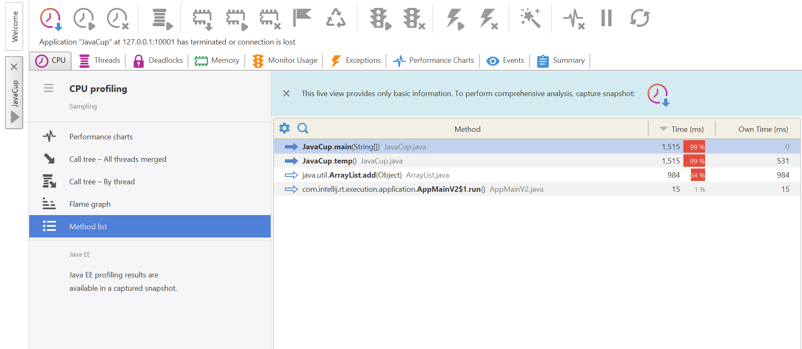
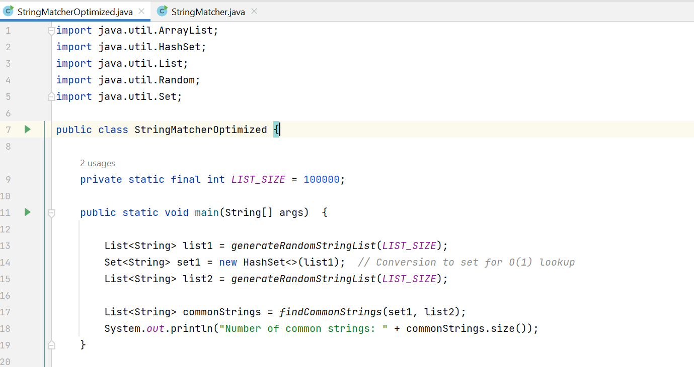

 ## آزمایشگاه مهندسی نرم‌افزار- آزمایش پنجم
## بخش اول

طبق خواسته‌ی آزمایش Yourkit را نصب کرده و به IDE اضافه می‌کنیم.

در مرحله‌ی بعد فایل JavaCup را با استفاده از آن ران می‌کنیم:

شکل زیر استفاده‌ی این فایل از منابع CPU را نشان می‌دهد:

با توجه به شکل بالا می‌توان گفت استفاده‌ی این کلاس از cpu بسیار بالاست.
در مرحله‌ی بعد استفاده از منابع Memory را چک می‌کنیم:

 همانطور که مشخص است حافظه‌ی heap نزدیک به پر شدن شده است. 

در شکل زیر Method list هم نشان داده شده است که مشخص می‌کند بیشتر مصرف مربوط به تابع temp است و Arraylist هم مصرف یالایی دارد:

با توجه به این موارد تابع temp را بررسی می‌کنیم تا ببینیم راهی برای تغییر آن وجود دارد یا خیر:

در این تابع چون مقدار iteration از پیش مشخص است، استفاده از ArrayList انتخاب بهینه‌ای نیست پس آن را به یک Array تبدیل می‌کنیم:

حال نتایج حاصل از تغییر را برای cpu و memory  بررسی می‌کنیم:

استفاده از cpu به میزان قابل توجهی کاهش یافته است.

این نتیجه برای حافظه هم برقرار است. 

Method list هم نشان‌دهنده‌ی این کاهش است

## بخش دوم

ابتدا یک کلاس جاوا به نام StringMatcher مطابق شکل زیر تعریف می‌کنیم. (این کلاس در پوشه‌ی Src موجود در ریپازیتوری قرار دارد)

سپس نتایج profiling  را بررسی می‌کنیم:

 با توجه به نتایج بالا تصمیم می‌گیریم تابع findCommonStrings را بهینه کنیم. به جای استفاده از دو لیست، از یک هش‌لیست استفاده می‌کنیم و به جای لوپ‌های تودرتو از یک لوپ استفاده می‌کنیم که complexity را از O(n) به O(1) می‌رساند.

 
 

 فایل تغییریافته‌ی بالا هم در پوشه‌ی src وجود دارند.

 نتایج profiling:

 
 

 همانطور که می‌بینید مصرف cpu و حافظه‌ی heap کاهش یافته است.